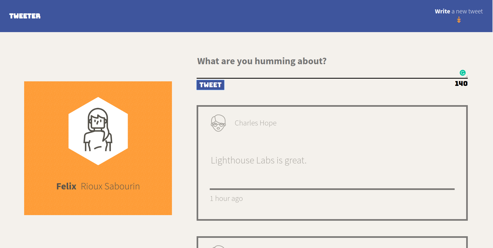
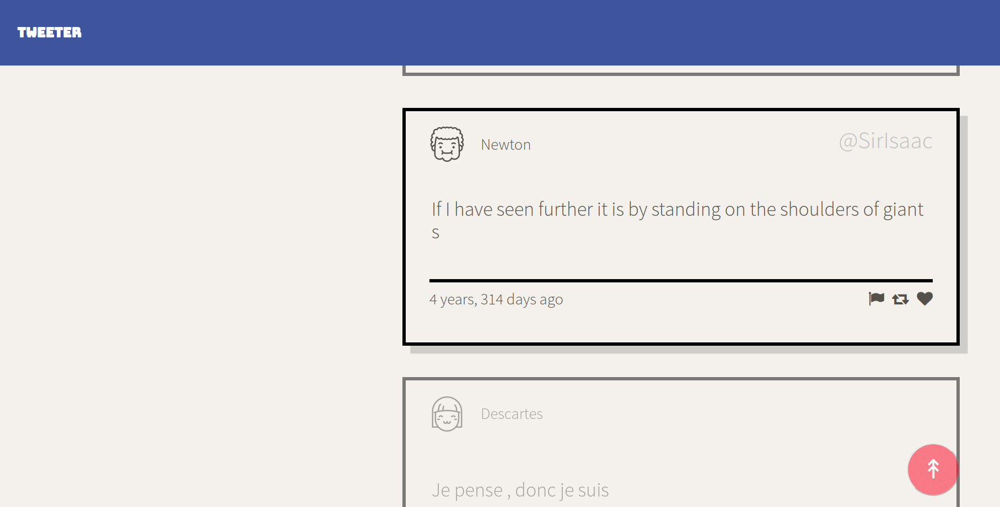
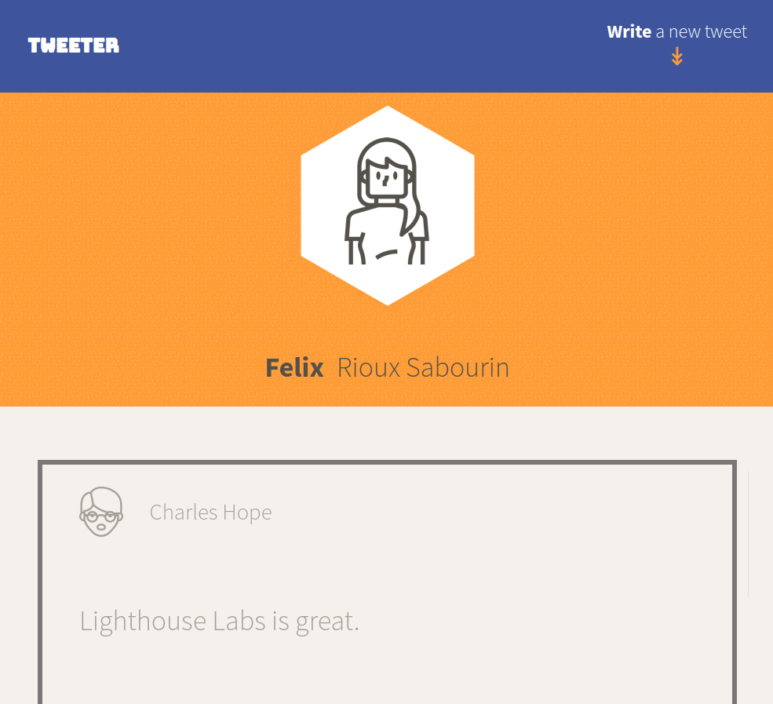
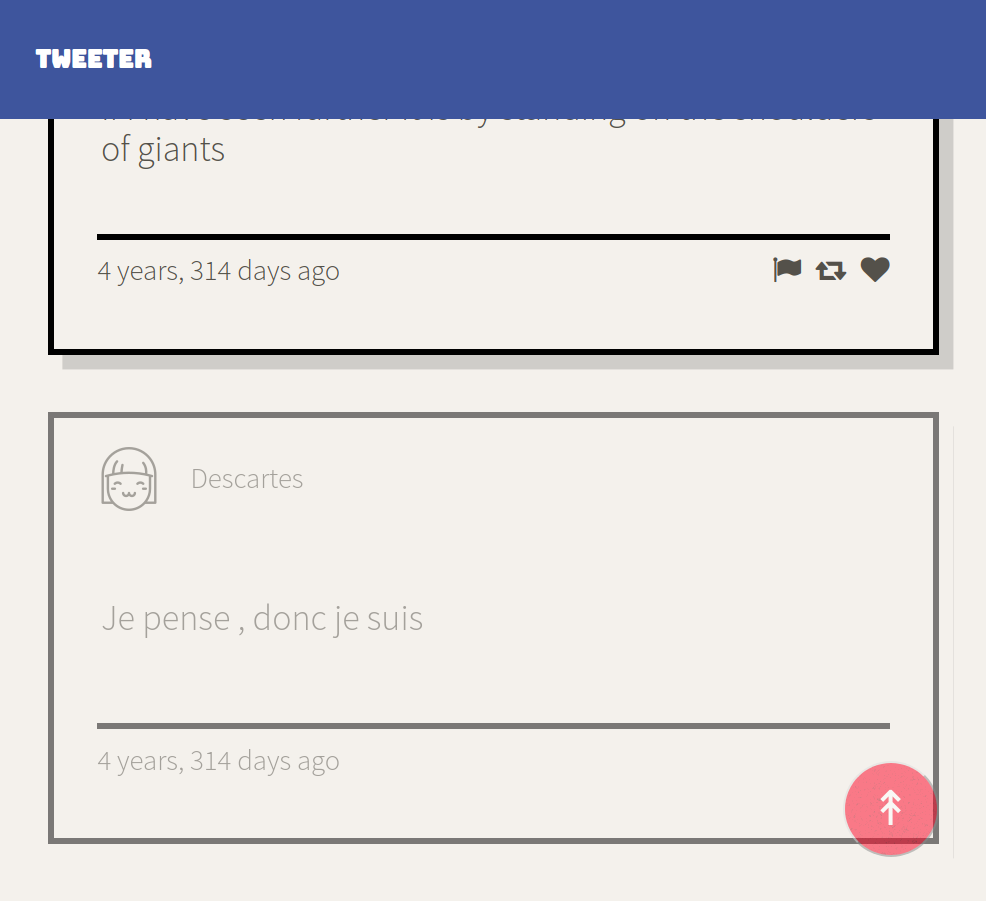

# Tweeter Project

Tweeter is a simple, single-page Twitter clone. Pramarily front-end focused, it uses ajax requests with jQuery to post tweets without refreshing the page.

This app was made by Felix Rioux Sabourin in February 2020, on week 4 of Lighthouse Labs' 12 weeks web bootcamp.

## Functionalities

The "write a new tweet" arrow triggers the form to appear, in which the user can type a new tweet to display on the page. Only tweets which are less than 140 characters and more than 0 characters will be displayed. Error messages are dynamically shown to the user if the checks do not pass.

Each tweet is time stamped, and includes the username, name of the user, and tweet body.

If the user scrolls out of view of the header, a convenient up arrow will appear, which will bring the user back to the top and open up the form to start tweeting.

The layout of the app will change dynamially depending on the type of device that the user uses.

## Getting Started

1. Fork this repository, then clone your fork of this repository.
2. Install dependencies using the `npm install` command.
3. Start the web server using the `npm run local` command. The app will be served at <http://localhost:8080/>.
4. Go to <http://localhost:8080/> in your browser.

## Dependencies

- Express
- Node 5.10.x or above
- Chance
- Body-parser

## Final Product

The front page will have the header on the left and the tweet content on the right for desktops.

The bottom of the page has a button to go back up.

When the screen is less than 1024px wide, the app will resize to have the header on the left and its content below.

Same functionalities as the desktop app, but with the content centered.
